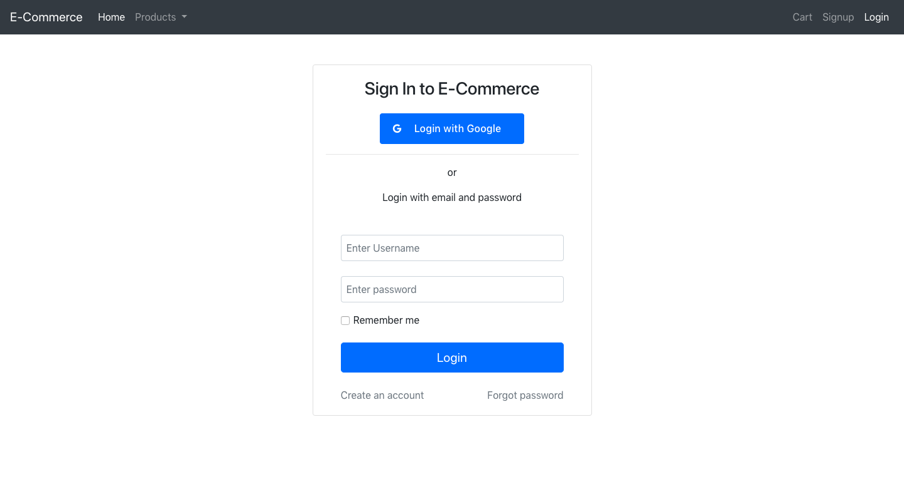
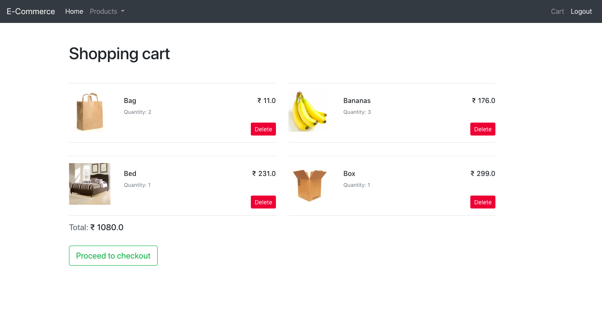
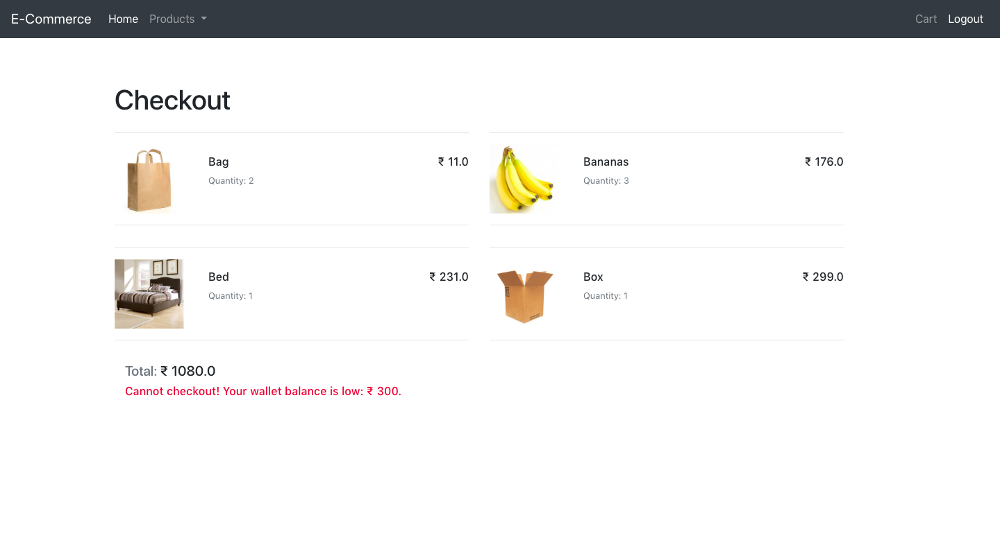

### E-Commerce site

A simple E-Commerce shopping site

### Screenshots

Home                       |    Products
:-------------------------:|:-------------------------:
 | 
Login                      | Shopping cart
|
Checkout                   | 
|


#### Setup

This project only supports Python3. Install the python package requirements using `pip`.

```bash
pip install -r requirements.txt
```

Run the migrate command to create database tables.

```bash
python manage.py migrate
```

Use the `createsuperuser` command to create a user who has superuser privileges.

```bash
python manage.py createsuperuser
```

Finally run the server using the `runserver` command.

```bash
python manage.py runserver
```


#### Testing

Linter test using Flake8

```bash
flake8 .
```

Unit tests and Coverage report.

```bash
pytest
```

The html coverage report will be generated and saved in the `htmlcov/` folder.